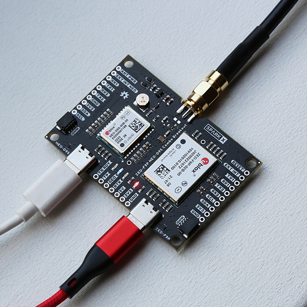
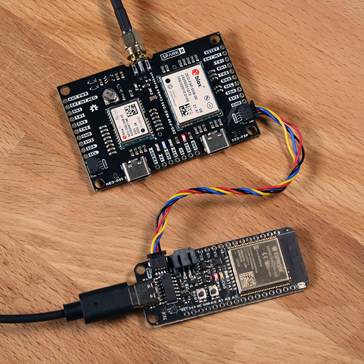

## Getting Started

Before you begin, you need to think about how you will use the SparkX u-blox ZED-F9P NEO-D9S Combo Breakout.

The Combo Breakout is a very versatile board, combining the u-blox ZED-F9P multi-band high precision GNSS module with the NEO-D9S L-band GNSS correction data receiver.

[{ width="200" }](./img/hookup_guide/USB_Hookup.jpg) 
*Hookup for u-center with two USB cables. (Click to enlarge)*

If you intend to use [u-blox's u-center (GNSS evaluation software for Windows)](https://www.u-blox.com/en/product/u-center) to configure both the ZED-F9P and the NEO-D9S
and log data from the ZED-F9P, all you need to get started is a pair of USB cables and a suitable antenna:

<table style="border-style:none">
    <tr>
        <td>
            <a href="https://www.sparkfun.com/products/17751">
                

                <h3 class="title">GNSS Multi-Band L1/L2 Surveying Antenna (TNC) - TOP106</h3>
            </a>
            GPS-17751
        </td>
        <td>
            <a href="https://www.sparkfun.com/products/14743">
                

                

                <h3 class="title">USB 3.1 Cable A to C - 3 Foot</h3>
            </a>
            CAB-14743
        </td>
    </tr>
</table>

The Combo Breakout has a single female SMA socket for the antenna connection. An on-board splitter (power divider) allows the ZED-F9P and NEO-D9S to share a single antenna. You need an antenna which supports both L1 and L2 GNSS, and which also provides broad coverage of the L-Band for the correction signal. Our TOP-106 antenna is a good choice. It has a TNC connection,
so you may also want to purchase a SMA to TNC interface cable and/or a SMA female to male extension cable, depending on your needs:

<table style="border-style:none">
    <tr>
        <td>
            <a href="https://www.sparkfun.com/products/17833">
                

                <h3 class="title">Interface Cable - SMA Male to TNC Male (300mm)</h3>
            </a>
            CAB-17833
        </td>
        <td>
            <a href="https://www.sparkfun.com/products/12861">
                

                

                <h3 class="title">Interface Cable - SMA Female to SMA Male (25cm)</h3>
            </a>
            WRL-12861
        </td>
    </tr>
</table>

## Getting Started with Arduino

[{ width="200" }](./img/hookup_guide/Arduino_Hookup.jpg) 
*Hookup for Arduino using Qwiic. (Click to enlarge)*

It is also possible to power the board and communicate with it using I2C by connecting to either of the board's **Qwiic** connectors.
SparkFun's [Qwiic Connect System](https://www.sparkfun.com/qwiic) uses 4-pin JST connectors, allowing you to quickly interface your development board to the Combo Board.

Our [u-blox GNSS Arduino Library](https://github.com/sparkfun/SparkFun_u-blox_GNSS_Arduino_Library) contains a comprehensive set of tried and tested examples that will work
on any Qwiic-enabled development board. There are dedicated examples for the ZED-F9P and NEO-D9S.

You can also use 3.3V Serial (UART) to communicate with both the ZED-F9P and NEO-D9S. Our Arduino Library supports both Serial and I2C. (It supports SPI too, but SPI
is not supported on the Combo Breakout).

When choosing a development board, you might want to choose one which has built-in WiFi. The correction data received by the NEO-D9S is encrypted, you need to pass keys to the
ZED-F9P so it can decrypt the data. A WiFi connection will allow you to download the PointPerfect SPARTN encryption keys directly from u-blox's Thingstream IoT service using MQTT.

You might also find a microSD card socket useful for data logging. If you want to log data while you are out in the field, being able to connect a Li-Po battery will be useful too.

These two ESP32 development boards support: Qwiic, Serial, WiFi, microSD and Li-Po.

<table style="border-style:none">
    <tr>
        <td>
            <a href="https://www.sparkfun.com/products/20168">
                

                <h3 class="title">SparkFun Thing Plus - ESP32 WROOM (USB-C)</h3>
            </a>
            WRL-20168
        </td>
        <td>
            <a href="https://www.sparkfun.com/products/19177">
                

                

                <h3 class="title">SparkFun IoT RedBoard - ESP32 Development Board</h3>
            </a>
            WRL-19177
        </td>
    </tr>
    <tr>
        <td>
            <a href="https://www.sparkfun.com/products/15081">
                

                <h3 class="title">SparkFun Qwiic Cable Kit</h3>
            </a>
            KIT-15081
        </td>
        <td>
            <a href="https://www.sparkfun.com/products/14743">
                

                

                <h3 class="title">USB 3.1 Cable A to C - 3 Foot</h3>
            </a>
            CAB-14743
        </td>
    </tr>
</table>

## Li-Po Battery

For mobile applications, users will want to pick up a <a href="https://www.sparkfun.com/categories/54">single-cell LiPo battery</a> from our catalog. Below, are a few available options:

<table style="border-style:none">
    <tr>
        <td>
            <a href="https://www.sparkfun.com/products/13855">
                

                <h3 class="title">Lithium Ion Battery - 2Ah</h3>
            </a>
            PRT-13855
        </td>
        <td>
            <a class="thumb" href="https://www.sparkfun.com/products/13851">
                

                

                <h3 class="title">Lithium Ion Battery - 400mAh</h3>
            </a>
            PRT-13851
        </td>
        <td>
            <a class="thumb" href="https://www.sparkfun.com/products/13813">
                

                

                <h3 class="title">Lithium Ion Battery - 1Ah</h3>
            </a>
            PRT-13813
        </td>
    </tr>
</table>

## Jumper Modification

To modify the jumpers, users will need <a href="https://www.sparkfun.com/categories/49">soldering equipment</a> and/or a <a href="https://www.sparkfun.com/categories/379">knife</a>.

<table style="border-style:none">
    <tr>
        <td>
            <a href="https://www.sparkfun.com/products/9325">
                

                <h3 class="title">Solder Lead Free - 100-gram Spool</h3>
            </a>
            TOL-09325
        </td>
        <td>
            <a class="thumb" href="https://www.sparkfun.com/products/14228">
                

                

                <h3 class="title">Weller WLC100 Soldering Station</h3>
            </a>
            TOL-14228
        </td>
        <td>
            <a class="thumb" href="https://www.sparkfun.com/products/14579">
                

                

                <h3 class="title">Chip Quik No-Clean Flux Pen - 10mL</h3>
            </a>
            TOL-14579
        </td>
        <td>
            <a class="thumb" href="https://www.sparkfun.com/products/9200">
                

                

                <h3 class="title">Hobby Knife</h3>
            </a>
            TOL-09200
        </td>
    </tr>
</table>

!!! note
    
New to jumpter pads? Check out our <a href="https://learn.sparkfun.com/tutorials/664">Jumper Pads and PCB Traces Tutorial</a> for a quick introduction!

    

        <a href="https://learn.sparkfun.com/tutorials/664">How to Work with Jumper Pads and PCB Traces 
        </a>
    

## Suggested Reading

As a more professionally oriented product, we will skip over the more fundamental tutorials (i.e. [**Ohm's Law**](https://learn.sparkfun.com/tutorials/voltage-current-resistance-and-ohms-law) and [**What is Electricity?**](https://learn.sparkfun.com/tutorials/what-is-electricity)). However, below are a few tutorials that may help users familiarize themselves with various aspects of the board.

<table style="border-style:none">
    <tr>
        <td align="center">
            <a href="https://learn.sparkfun.com/tutorials/61">Installing the Arduino IDE 
            </a>
        </td>
        <td align="center">
            <a href="https://learn.sparkfun.com/tutorials/1265">Installing Board Definitions in the Arduino IDE 
            </a>
        </td>
        <td align="center">
            <a href="https://learn.sparkfun.com/tutorials/12">Installing an Arduino Library 
            </a>
        </td>
    </tr>
    <tr>
        <td align="center">
            <a href="https://learn.sparkfun.com/tutorials/908">How to Install CH340 Drivers 
            </a>
        </td>
        <td align="center">
            <a href="https://learn.sparkfun.com/tutorials/5">How to Solder: Through-Hole Soldering 
            </a>
        </td>
        <td align="center">
            <a href="https://learn.sparkfun.com/tutorials/664">How to Work with Jumper Pads and PCB Traces 
            </a>
        </td>
    </tr>
    <tr>
        <td align="center">
            <a href="https://learn.sparkfun.com/tutorials/8">Serial Communication 
            </a>
        </td>
        <td align="center">
            <a href="https://learn.sparkfun.com/tutorials/89">Analog vs. Digital 
            </a>
        </td>
        <td align="center">
            <a href="https://learn.sparkfun.com/tutorials/51">Pulse Width Modulation 
            </a>
        </td>
    </tr>
    <tr>
        <td align="center">
            <a href="https://learn.sparkfun.com/tutorials/62">Logic Levels 
            </a>
        </td>
        <td align="center">
            <a href="https://learn.sparkfun.com/tutorials/82">I2C 
            </a>
        </td>
        <td align="center">
            <a href="https://learn.sparkfun.com/tutorials/16">Serial Peripheral Interface (SPI) 
            </a>
        </td>
    </tr>
</table>

    

        

            
        

    

One of the new, advanced features of our Processor Boards is that they take advantage of the [Qwiic connect system](https://www.sparkfun.com/qwiic). We recommend familiarizing yourself with the **Logic Levels** and **I2C** tutorials.  Click on the banner above to learn more about [Qwiic products](https://www.sparkfun.com/qwiic).

    <iframe width="600" height="327" src="https://www.youtube.com/embed/x0RDEHqFIF8" title="SparkFun's Qwiic Connect System" frameborder="0" allow="accelerometer; autoplay; clipboard-write; encrypted-media; gyroscope; picture-in-picture" allowfullscreen></iframe>

