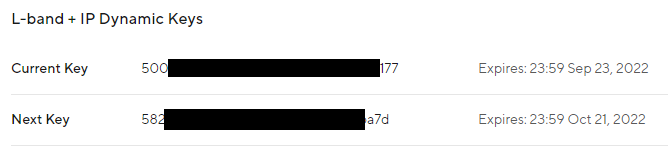
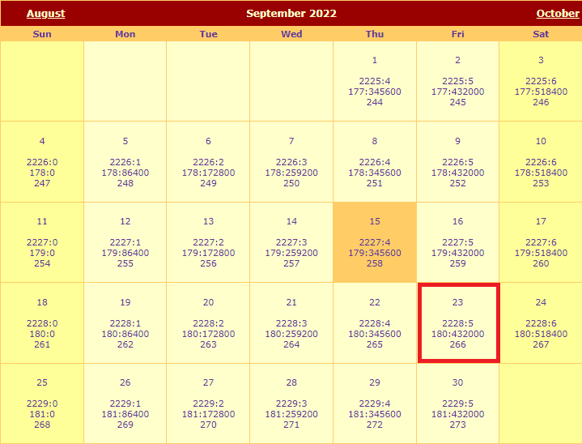
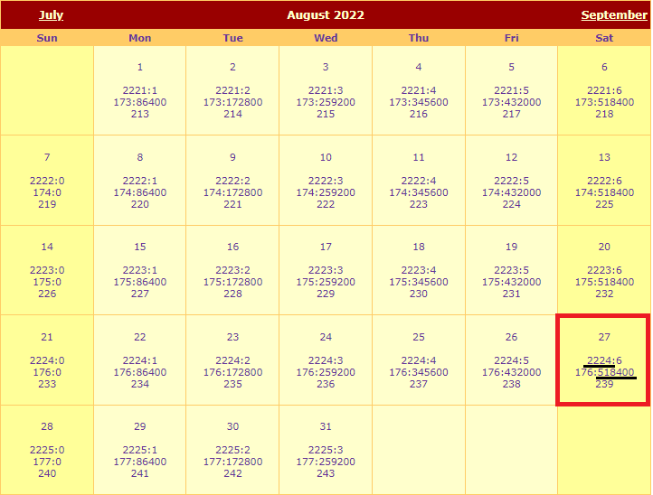

## Software Overview

There are three key steps to be able to achieve centimeter positioning accuracy using the ZED-F9P NEO-D9S Combo Breakout:

* Register with u-blox Thingstream and sign up for a PointPerfect L-band plan (data stream)
* Configure the NEO-D9S to receive the u-blox PointPerfect correction data stream
* Configure the ZED-F9P with encryption key(s) so it can decrypt and use the correction data

By default, the Combo Breakout is configured such that the correction data is passed from the NEO to the ZED using the UART2 interface.
However, it is also possible to read the correction data from the NEO and push (write) it to the ZED using I<sup>2</sup>C.

## Thingstream and PointPerfect

[Thingstream](https://www.u-blox.com/en/product/thingstream) is u-blox service delivery platform for IoT Communication-as-a-Service, IoT Security-as-a-Service and IoT Location-as-a-Service.

[PointPerfect](https://www.u-blox.com/sites/default/files/PointPerfect_ProductSummary_UBX-21024758.pdf) is u-blox GNSS augmentation service which is designed to provide high-precision GNSS corrections to suitable receivers to provide decimeter-level location accuracy.

PointPerfect data is delivered through Thingstream. The first step is to [register with Thingstream](https://portal.thingstream.io/register) and then request an L-Band plan:

<center>
[{ width="400" }](./img/hookup_guide/PointPerfect_Pricing.png)<br>
*PointPerfect pricing (correct at Sept. 14th 2022). (Click to enlarge)*
</center>

You can find the current pricing on [u-blox portal](https://portal.thingstream.io/pricing). Select **IoT Location-as-a-Service** and then **PointPerfect**.

You may need to [contact u-blox](mailto:support@thingstream.io) first, to enable the option to purchase an L-Band plan through your Thingstream account.

The **PointPerfect L-band** plan provides unlimited access to the L-band satellite correction data stream (via the NEO-D9S).

If you have an internet connection, you can also receive PointPerfect corrections via IP (MQTT). The **PointPerfect L-band and IP** plan may be a better choice if
you think you may want to receive correction data via both satellite and Internet.

Once L-band permissions are enabled on your Thingstream account, you will be able to add a new L-band Location Thing and view its credentials:

* [Login to Thingstream](https://portal.thingstream.io/)
* Select **Location Services** and then **Location Things**
* The **Add Location Thing** button (top right) will allow you to select and activate an L-Band plan
* Once your L-band plan is active, you will be able to monitor your **Activity** and view your **Credentials** via the appropriate tabs

u-blox have written a [comprehensive application note](https://www.u-blox.com/sites/default/files/documents/NEO-D9S_ZED-F9_Config_SPARTN_AppNote_UBX-22008160.pdf) which
describes in detail: the configuration of both NEO and ZED; and how to interpret the expiry date for the L-band encryption keys. In the following sections, we describe how
to configure the NEO and ZED using our [u-blox GNSS Arduino Library](https://github.com/sparkfun/SparkFun_u-blox_GNSS_Arduino_Library).

## NEO-D9S Configuration

The first step is to declare the **`SFE_UBLOX_GNSS`** object. Like most Arduino sketches, this is done at a global scope (after the include file declaration), not within the ```setup()``` or ```loop()``` functions. 

```C++
#include <SparkFun_u-blox_GNSS_Arduino_Library.h> //http://librarymanager/All#SparkFun_u-blox_GNSS
SFE_UBLOX_GNSS myLBand; // NEO-D9S
```

Within ```setup()``` we then need to start (initialize) communiation with the NEO-D9S.
The NEO-D9S has a default I<sup>2</sup>C address of 0x43 and so we need to provide that when calling the ```begin``` method:

```C++
  Wire.begin(); //Start I2C

  while (myLBand.begin(Wire, 0x43) == false) //Connect to the u-blox NEO-D9S using Wire port. The D9S default I2C address is 0x43 (not 0x42)
  {
    Serial.println(F("u-blox NEO-D9S not detected at default I2C address. Please check wiring."));
    delay(2000);
  }
  Serial.println(F("u-blox NEO-D9S connected"));

```

The NEO-D9S needs to be configured so it can receive the PointPerfect correction stream. The configuration items are: 

| Configuration item | Default value |
| :----------------- | :---- |
| CFG-PMP-CENTER_FREQUENCY | 1539812500 Hz |
| CFG-PMP-SEARCH_WINDOW | 2200 Hz |
| CFG-PMP-USE_SERVICE_ID | 1 (true)|
| CFG-PMP-SERVICE_ID | 50821 |
| CFG-PMP-DATA_RATE | 2400 (B2400) bps |
| CFG-PMP-USE_DESCRAMBLER | 1 (true) |
| CFG-PMP-DESCRAMBLER_INIT | 23560 |
| CFG-PMP-USE_PRESCRAMBLING | 0 (false) |
| CFG-PMP-UNIQUE_WORD | 0xe15ae893e15ae893 |

The centre frequency varies depending on which satellite is broadcasting corrections for your geographical area.
The frequency for the USA is different to that for Europe:

The up-to-date frequencies are distributed via the MQTT **/pp/frequencies/Lb** topic. At the time of writing, they are (in MHz):

```C++
{
  "frequencies": {
    "us": {
      "current": {
        "value": "1556.29"
      }
    },
    "eu": {
      "current": {
        "value": "1545.26"
      }
    }
  }
}
```

We can add those to the code as follows:

```C++
const uint32_t myLBandFreq = 1556290000; // Uncomment this line to use the US SPARTN 1.8 service
//const uint32_t myLBandFreq = 1545260000; // Uncomment this line to use the EU SPARTN 1.8 service
```

The code to configure the NEO-D9S is as follows. Note that the **`UBLOX_CFG_PMP_USE_SERVICE_ID`**, **`UBLOX_CFG_PMP_SERVICE_ID`** and **`UBLOX_CFG_PMP_DESCRAMBLER_INIT`**
also need to be changed.

```C++
  uint8_t ok = myLBand.setVal32(UBLOX_CFG_PMP_CENTER_FREQUENCY,   myLBandFreq); // Default 1539812500 Hz
  if (ok) ok = myLBand.setVal16(UBLOX_CFG_PMP_SEARCH_WINDOW,      2200);        // Default 2200 Hz
  if (ok) ok = myLBand.setVal8(UBLOX_CFG_PMP_USE_SERVICE_ID,      0);           // Default 1 
  if (ok) ok = myLBand.setVal16(UBLOX_CFG_PMP_SERVICE_ID,         21845);       // Default 50821
  if (ok) ok = myLBand.setVal16(UBLOX_CFG_PMP_DATA_RATE,          2400);        // Default 2400 bps
  if (ok) ok = myLBand.setVal8(UBLOX_CFG_PMP_USE_DESCRAMBLER,     1);           // Default 1
  if (ok) ok = myLBand.setVal16(UBLOX_CFG_PMP_DESCRAMBLER_INIT,   26969);       // Default 23560
  if (ok) ok = myLBand.setVal8(UBLOX_CFG_PMP_USE_PRESCRAMBLING,   0);           // Default 0
  if (ok) ok = myLBand.setVal64(UBLOX_CFG_PMP_UNIQUE_WORD,        16238547128276412563ull); // 0xE15AE893E15AE893
```

Finally, we need to ensure that the UART2 port is set correctly. We need to:

* Change the baud rate to 38400 - to match the ZED-F9P's baud rate
* Ensure that the **UBX** protocol is enabled for output on UART2
* Enable the **RXM PMP** message on UART2
    * The **RXM PMP** message contains the **SPARTN** correction data in **UBX** format
* Perform a restart (software reset) so that the NEO-D9S starts using the new configuration items

```C++
  if (ok) ok = myLBand.setVal32(UBLOX_CFG_UART2_BAUDRATE,         38400); // match baudrate with ZED default
  if (ok) ok = myLBand.setVal(UBLOX_CFG_UART2OUTPROT_UBX,         1);     // Enable UBX output on UART2
  if (ok) ok = myLBand.setVal(UBLOX_CFG_MSGOUT_UBX_RXM_PMP_UART2, 1);     // Output UBX-RXM-PMP on UART2
  
  Serial.print(F("L-Band configuration: "));
  if (ok)
    Serial.println(F("OK"));
  else
    Serial.println(F("NOT OK!"));

  myLBand.softwareResetGNSSOnly(); // Do a restart
```

Once the NEO-D9S has aquired the signal from the satellite, it will start outputting **PMP** correction messages to the ZED-F9P on UART2.

## ZED-F9P Configuration

We need to declare a second **`SFE_UBLOX_GNSS`** object for the ZED-F9P. Again, this is done at a global scope (after the include file declaration), not within the ```setup()``` or ```loop()``` functions. 

```C++
SFE_UBLOX_GNSS myGNSS; // ZED-F9P
```

Within ```setup()``` we need to start (initialize) communiation with the ZED-F9P:

```C++
  while (myGNSS.begin() == false) //Connect to the u-blox module using Wire port and the default I2C address (0x42)
  {
    Serial.println(F("u-blox GNSS module not detected at default I2C address. Please check wiring."));
    delay(2000);
  }
  Serial.println(F("u-blox GNSS module connected"));
```

We then need to:

* Make sure the ZED-F9P's UART2 port is configured to accept the PMP correction data
* Tell the ZED-F9P to use FIXED carrier solutions when possible (this is the default setting)
* Tell the ZED-F9P to accept L-band PMP as a correction source

```C++
          ok = myGNSS.setPortInput(COM_PORT_UART2, COM_TYPE_UBX | COM_TYPE_NMEA | COM_TYPE_SPARTN); //Be sure SPARTN input is enabled
  if (ok) ok = myGNSS.setDGNSSConfiguration(SFE_UBLOX_DGNSS_MODE_FIXED); // Set the differential mode - ambiguities are fixed whenever possible
  if (ok) ok = myGNSS.setVal8(UBLOX_CFG_SPARTN_USE_SOURCE, 1); // use LBAND PMP message
```

The final piece of the puzzle is to provide the ZED-F9P with the keys it needs to decrypt the encrypted SPARTN (PMP) corrections.

The ZED-F9P can hold two dynamic keys: the current key; and the next key. We also need to tell it when each key is valid from, so it knows when to switch to the next key.

You can find the current and next keys in the **Location Services** \ **Location Things** \ **Thing Details** \ **Credentials** tab in Thingstream:

<center>
[{ width="400" }](./img/hookup_guide/Dynamic_Keys.png)<br>
*PointPerfect L-band dynamic keys. (Click to enlarge)*
</center>

The ZED-F9P actually needs to know when the keys are valid **from**, rather than when they expire. We need to work backwards 4 weeks from the expiry date.

The current key expires at midnight (UTC) at the end of Friday September 23rd. This means it became valid 4 weeks earlier at midnight (UTC) on August 27th:

<center>
[{ width="400" }](./img/hookup_guide/Key_Expiry.png)  [{ width="400" }](./img/hookup_guide/Key_Valid_From.png)<br>
*Dynamic Key: Expiry and Valid From dates. (Click to enlarge)*
</center>

Using the website recommended in the u-blox Application Note:

**http://navigationservices.agi.com/GNSSWeb**

we can see that the key became valid during GPS week **2224**, at time-of-week **518400**.

We can use the Arduino Library **`setDynamicSPARTNKey`** method to configure a single key:

```C++
  if (ok) ok = myGNSS.setDynamicSPARTNKey(16, 2224, 518400, "500--------------------------177");

  Serial.print(F("GNSS: configuration "));
  if (ok)
    Serial.println(F("OK"));
  else
    Serial.println(F("NOT OK!"));
```

Alternately, we can set both the current key and the next key together using **`setDynamicSPARTNKeys`**. The next key becomes valid during GPS week **2228**:

```C++
  if (ok) ok = myGNSS.setDynamicSPARTNKeys(16, 2224, 518400, "500--------------------------177", 16, 2228, 518400, "582--------------------------a7d");
```

The keys can also be retrieved using MQTT. We have an [Arduino Library example](https://github.com/sparkfun/SparkFun_u-blox_GNSS_Arduino_Library/tree/main/examples/ZED-F9P/Example20_PMP_with_L-Band_Keys_via_MQTT)
which shows how to retrieve the keys from the L-band + IP key distribution topic **/pp/ubx/0236/Lb**. But note that the MQTT topic provides the **valid from** in Unix epoch format,
in milliseconds, excluding the 18 leap seconds since GPS time started!

```C++
{
  "dynamickeys": {
    "current": {
      "start": "1661558382000",
      "duration": "2419199999",
      "value": "500--------------------------177"
    },
    "next": {
      "start": "1663977582000",
      "duration": "2419199999",
      "value": "582--------------------------a7d"
    }
  }
}
```
