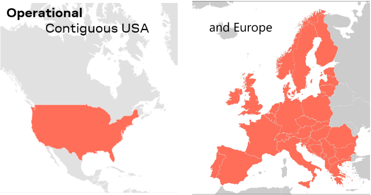

!!! note
    
 <strong>Not working as expected and need help? </strong>

    
<a href="https://www.sparkfun.com/sparkx">SparkX</a> products are rapidly produced to bring you the most cutting edge technology as it becomes available. These products are tested but come with no guarantees. Live technical support is not available for SparkX products. Head on over to our <a href="https://forum.sparkfun.com/viewforum.php?f=123">forum</a> for support or to ask a question.

    

    [SparkX Forum](https://forum.sparkfun.com/viewforum.php?f=123){ .md-button .md-button--primary }
    

    
You'll need a <a href="https://forum.sparkfun.com/ucp.php?mode=register">Forum Account</a> to search the product forums and post questions.

!!! warning
    u-blox provides products and services to "B2B Customers". Only business customers are eligible to register for a Thingstream (PointPerfect) account. You may be required to demonstrate that the use of the combo breakout is in relation to your trade, business, craft or profession. u-blox products and services are not intended for individual consumer use.

## PointPerfect L-band Reception

In order to receive the u-blox PointPerfect correction data, you will: need a suitable antenna; need to be located within contiguous USA or Europe; and have a clear view of the sky to the South.

### SparkFun GNSS Multi-Band L1/L2 Surveying Antenna - TOP106

We have been successful using the [SparkFun GNSS Multi-Band L1/L2 Surveying Antenna (TNC) - TOP106 (GPS-17751)](https://www.sparkfun.com/products/17751) antenna to receive
PointPerfect correction data in both the USA and Europe.

### PointPerfect Coverage

The PointPerfect GNSS augmentation service is available on a continental scale with seamless coverage in Europe and contiguous USA, including up to 12 nautical miles  (~ 22 km) off coastlines. u-blox are continuously expanding their coverage according to market demand.

[{ width="200" }](./img/hookup_guide/pointperfect_coverage.png) 
*PointPerfect Service Coverage. (Click to enlarge)*

### PointPerfect Satellite Broadcast

PointPerfect augmentation data is broadcast from satellites covering Europe and contiguous USA. The satellites are in geostationary orbits over the equator - the same as for satellite television broadcasts. It is essential that your antenna has an unobstructed view of the sky, especially to the South where the satellite is positioned.

Depending on your latitude, the satellite for your area could be low in the sky. You need to ensure that trees, buildings etc. are not blocking the signal.
